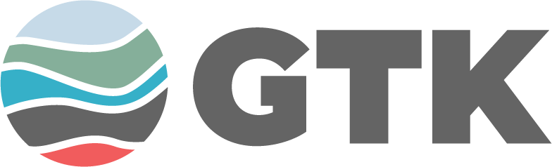
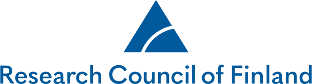

::: {.page-header}
# AI in Earth & Planetary Science

[AI is no longer peripheral in geoscience. It is actively reshaping how we interpret the subsurface, quantify uncertainty, and make decisions under incomplete data.]{.tagline}
:::

::: {.content-body}

AIEPS is a community for geoscience students, researchers, and practitioners who want to apply AI and scientific machine learning in a way that remains physically grounded and practically useful. It is also a space for ML researchers looking for hard, meaningful problems, where data are noisy, multi-scale, and tied to real operational decisions.

Geoscience has always advanced by combining observation, theory, and computation. AI extends that tradition, but only when combined with domain knowledge, numerical structure, and rigorous validation. The central question is not whether AI can produce an output, but whether that output is scientifically defensible and decision-relevant.

This website is a living hub for that work. As talks, workshop sessions, and materials evolve, the pages are updated so participants can quickly find current schedules, speaker details, and entry points for learning.

If you are getting started, begin with the workshop hands-on sessions. If you are already active in research or development, use the seminars to track emerging methods, practical lessons, and current debates across AI for Earth and planetary sciences.

::: {.home-grid}
::: {.home-card}
### Annual workshop

Two-day programme with hands-on sessions, invited experts, and practical workflows you can use immediately.

[2026 workshop](workshops/2026.qmd){.card-link}
:::

::: {.home-card}
### Monthly webinars

Research-focused online talks on methods, applications, and lessons learned across AI for geoscience.

[2026 seminars](seminars/2026.qmd){.card-link}
:::
:::

::: {.supported-by}
Supported by

::: {.sponsor-logos}
[{.sponsor-logo .sponsor-logo--gtk}](https://www.gtk.fi/en/)
[{.sponsor-logo .sponsor-logo--rcf}](https://www.aka.fi/en/)
:::
:::

:::
